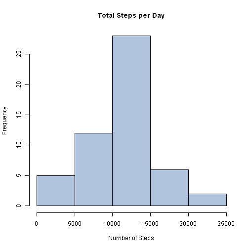
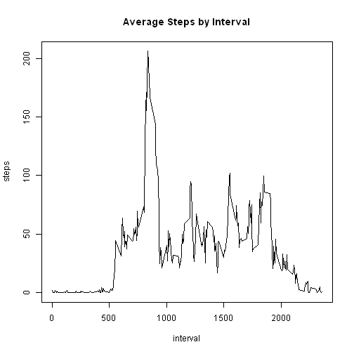

# Reproducible Research: Peer Assessment 1
**Completed May, 18 2014**


## Loading and preprocessing the data
### 1) Load the data

```r
download.file("http://d396qusza40orc.cloudfront.net/repdata%2Fdata%2Factivity.zip", 
    "activity.zip")
unzip("activity.zip")
data_set <- read.csv("activity.csv", as.is = TRUE)
```

### 2) Process/transform the data (if necessary) into a format suitable for your analysis


```r
# Coerce the date column to a Date data type.
data_set$date <- as.Date(data_set$date)

# Compute the actual minutes from the start of each day form the interval
# data and add it to the data set.
minutes <- ((data_set$interval - data_set$interval%%100)/100 * 60) + data_set$interval%%100
data_set <- cbind(data_set, minutes)
```

___
## What is mean total number of steps taken per day?
### 1) Make a histogram of the total number of steps taken each day

```r
# Create aggregate data frame. Omit NAs. (This is done by default but the
# parameter was included here for clarity)
total_steps_by_day <- aggregate(steps ~ date, data_set, sum, na.action = na.omit)
# Produce histogram
hist(total_steps_by_day$steps, main = "Total Steps per Day", xlab = "Number of Steps", 
    col = "LightSteelBlue")
```

 

### 2) Calculate and report the mean and median total number of steps taken per day

```r
# Please note that NAs were omitted in the creation of the
# total_steps_by_day data frame.
mean_steps <- mean(total_steps_by_day$steps)
median_steps <- median(total_steps_by_day$steps)
```

**Results:**  
Mean Steps per Day: 10766  
Median Steps per Day: 10765
___

## What is the average daily activity pattern?
### 1) Make a time series plot (i.e. type = "l") of the 5-minute interval (x-axis) and the average number of steps taken, averaged across all days (y-axis)

```r
# Create aggregate data frame.
average_steps_by_interval <- aggregate(steps ~ interval, data_set, mean, na.action = na.omit)
# produce plot
plot(average_steps_by_interval, type = "l", main = "Average Steps by Interval")
```

 


###2) Which 5-minute interval, on average across all the days in the dataset, contains the maximum number of steps?

```r
max_steps <- subset(average_steps_by_interval, average_steps_by_interval$steps == 
    max(average_steps_by_interval$steps), select = interval)
```

**Results:**  
Interval with the most steps: 835

___
## Imputing missing values
### 1)Calculate and report the total number of missing values in the dataset (i.e. the total number of rows with NAs)

```r
missing_values <- sum(is.na((subset(data_set, is.na(steps), select = steps))))
```

**Results:**  
Number of missing values: 2304

###2) Devise a strategy for filling in all of the missing values in the dataset. The strategy does not need to be sophisticated. For example, you could use the mean/median for that day, or the mean for that 5-minute interval, etc.


```r
merged_data_set <- merge(data_set, average_steps_by_interval, by = "interval")
merged_data_set1 <- subset(merged_data_set, is.na(steps.x), select = c(steps.y, 
    date, interval))
merged_data_set2 <- subset(merged_data_set, !is.na(steps.x), select = c(steps.x, 
    date, interval))
names(merged_data_set1) <- c("steps", "date", "interval")
names(merged_data_set2) <- c("steps", "date", "interval")
merged_data_set <- rbind(merged_data_set1, merged_data_set2)
merged_data_set <- merged_data_set[with(merged_data_set, order(date, interval)), 
    ]
```


**Ran out of time here sorry**
___
## Are there differences in activity patterns between weekdays and weekends?
